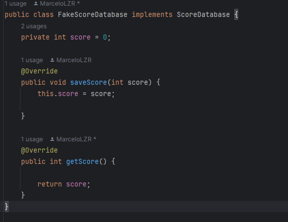
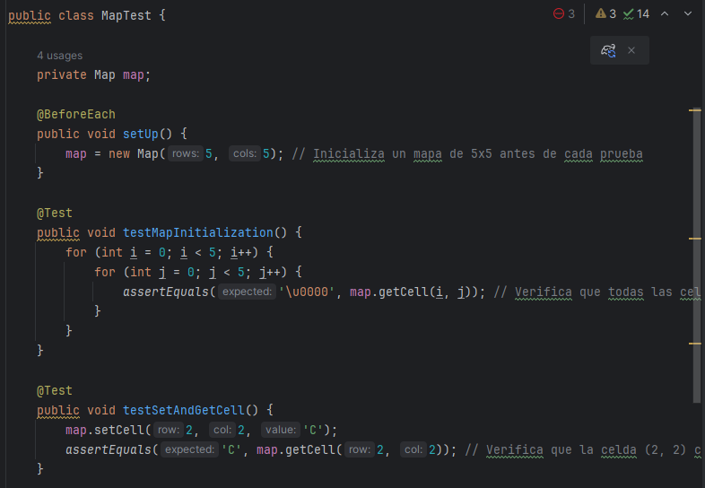
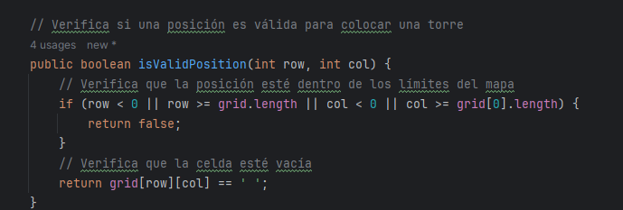
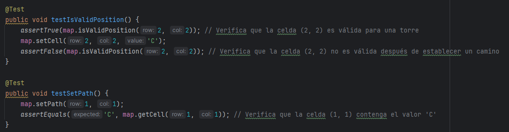
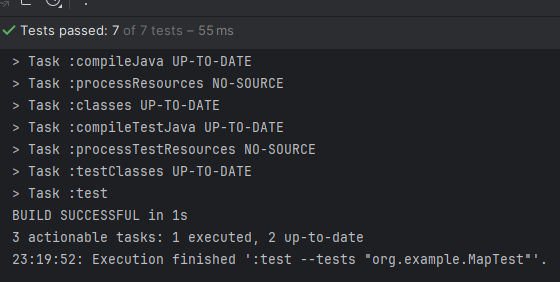

### MEJORAS Y CORRECCIONES PC4
### Nombre del problema: Tower Defense

Para la implementacion inicial no cambie mucho respecto a lo enviado sin embargo hice unas pequeñas modificaciones en la clase `Game`:

#### Cambio en la inicialización del mapa:

- Antes: this.map = new Map();
- Ahora: this.map = new Map(mapRows, mapCols);
Esto se hizo para corregir el error de instanciación de la clase abstracta Map.


#### Adición del método initializeMap:

Se agregó para inicializar el mapa con un diseño predefinido.


#### Ajuste del método placeTower:

Anteriormente, la colocación de torres y su validación se hacían directamente.
Ahora se utiliza createTower para crear instancias de torres según su tipo.


#### Adición del método startNextWave:

Se ajustó para inicializar una nueva oleada y mostrar información sobre los enemigos.

#### Adición del método displayGameState:

Se agregó para mostrar el estado actual del juego, incluyendo la puntuación y la vida de la base.


#### Adición del método simulateGame:

Se agregó un bucle para permitir la entrada del usuario y simular el juego, manejando acciones como colocar torres e iniciar oleadas.


Ahora la compilacion se ve asi:


Estos cambios se realizaron para poder hacer las pruebas:
### Implementación de pruebas
#### Mocks:

- Utiliza Mockito para crear mocks de las clases Enemy y Tower para verificar la interacción
entre objetos.

Primero agregamos la dependencia para usar mockito al buildgradle de nuestro proyecto: 

Recordemos que un stub se utiliza para simular el comportamiento de componentes dependientes (en este caso, enemigos y torres) con el fin de aislar la lógica que queremos probar.

Ahora escribimos la prueba:


Este test:

- Crea instancias simuladas de Tower y Enemy.
- Configura estas instancias para devolver valores específicos cuando se llamen a ciertos métodos.
- Simula un ataque donde la torre inflige daño al enemigo.
- Verifica que los métodos de la torre y el enemigo se llamaron el número correcto de veces.
- Verifica que el daño infligido y la salud restante del enemigo son los valores esperados.
- Esto asegura que la lógica básica de aplicar daño de una torre a un enemigo se comporta correctamente en términos de las interacciones y el cálculo de salud restante.


#### Stubs:
- Crea stubs para métodos que devuelven enemigos o torres específicos.

Nuestro objetivo es probar la generación de enemigos en una oleada (Wave) específica.

Ejemplo con Torre (Tower)

Definición de la Interfaz y la Implementación de la Fábrica de Torres (TowerFactory y CannonTowerFactory):

Creo la interfaz:


En este caso, CannonTowerFactory implementa TowerFactory y tiene un método createTower que crea una torre específica (CannonTower) según el tipo especificado ("Cannon" en este caso).


Ahora necesito escribir una prueba unitaria utilizando un stub (CannonTowerFactoryStub) en lugar de la implementación real (CannonTowerFactory) para asegurarnos de que estamos probando solo la lógica que nos interesa y no el comportamiento real de la fábrica.


En la prueba, se utiliza CannonTowerFactoryStub en lugar de CannonTowerFactory. Se llama al método createTower("Cannon") en towerFactory, que debería devolver una instancia de CannonTower (gracias al stub). Luego, verificamos que los atributos de la torre (damage, range, fireRate) coinciden con los valores esperados.


#### El mismo principio se aplica para el caso para probar enemigos usando stubs:


y


Ahora se escribira una prueba unitaria que utiliza un stub (BasicEnemyFactoryStub) para simular la creación de enemigos. Esta prueba verificara que los atributos (speed, health, reward) de un enemigo creado coincidan con los valores esperados.


En la prueba, utilizamos BasicEnemyFactoryStub en lugar de BasicEnemyFactory. Llamamos al método createEnemy("Basic") en enemyFactory, que debería devolver una instancia de BasicEnemy (gracias al stub). Luego, verificamos que los atributos del enemigo (speed, health, reward) coincidan con los valores esperados.


#### Fakes:

- Utilizar fakes para simular la base de datos de puntuación o estados de oleadas.

Implementare un fake simple para simular la base de datos de puntuación del jugador.
Vamos a crear clases que simulen la base de datos de puntuación y los estados de oleada

##### Fake para la Base de Datos de Puntuación: 




##### Fake para Estados de Oleadas: 


Ahora vamos a escribir una prueba unitaria que utilice estos fakes para simular el comportamiento de la base de datos de puntuación y los estados de oleadas.


- Prueba testFakeScoreDatabase: Utiliza FakeScoreDatabase para simular el almacenamiento y recuperación de puntajes. Primero, guardamos un puntaje de 1000 y luego verificamos que se haya guardado correctamente llamando a getScore().

- Prueba testFakeWaveState: Utiliza FakeWaveState para simular el seguimiento de los estados de oleadas en el juego. Verificamos inicialmente que la oleada actual sea la número 1. Luego, avanzamos a la siguiente oleada llamando a advanceToNextWave() y verificamos que ahora la oleada actual sea la número 2.


#### Pruebas de mutación:
- Implementa pruebas de mutación para verificar la calidad de las pruebas unitarias.
- ¿Qué herramienta utilizarías para realizar pruebas de mutación en este proyecto, y cómo la
configurarías?


En esta parte de igual manera que la anterior se usara pitest, con una correcion, pues en el avance de la pc4 mi cobertura era de 0 % pero era debido a que no compilaba mis test antes de el reporte para solucionar eso se agrega la siguiente linea en el gradle:


Entonces ahora ejecuto con el comando `./gradlew pitest` y abrimos el reporte:


 Aunque mis pruebas tienen un buen nivel de fuerza (100%, es decir que todas las pruebas pasan correctamente), la cobertura de mutación del 18% sugiere que podría haber áreas en las cuales las mutaciones introducidas no están siendo suficientemente probadas. Esto es cierto pues se ha escrito pruebas solo para algunas clases, sin embargo podemos aunmentar la cobertura revisando las mutaciones que no fueron detectadas y ajustar las pruebas para capturar estos casos.


Por ejemplo hare un test para Map puesto que no hemos cbuierto esa clase:



Y si ahora ejecuto el pitest:


Aumento a 25%, dado que el objetivo no es hacer pruebas unitarias para cada clase si no mas bien mostrar ejemplos de mocks,stubs y fakes, podemos decir que nuestra cobertura de mutaciones es la correcta.

### Preguntas de diseño e implementación (5 puntos)

#### Diseño de la clase Map:
- ¿Cómo implementarías la clase Map para representar el mapa del juego, asegurando que se
puedan agregar y verificar posiciones de torres y caminos?

   1. Definir los caracteres para representar diferentes elementos del mapa.
   2. Agregar métodos para verificar si una posición es válida para colocar una torre.
   3. Agregar métodos para establecer caminos y torres.


- Implementa un método en la clase Map llamado isValidPosition(int x, int y) que verifique si
una posición es válida para colocar una torre.



   - Verifica si la posición está dentro de los límites del mapa.
   - Verifica si la celda está vacía (' ').


   - Utilizan isValidPosition(int row, int col) para asegurarse de que la posición sea válida antes de establecer un camino ('C') o una torre ('T').
   - Si la posición no es válida, lanzan una excepción IllegalArgumentException.

   Agregio estos test a mi clase MapTest para verificar la funcionalidad de la nueva implementación:




#### Enemigos con diferentes características:
- Diseña e implementa una clase SpeedyEnemy que herede de Enemy y tenga una velocidad
mayor pero menos vida.


- ¿Cómo gestionarías el movimiento de los enemigos en el mapa, asegurando que sigan el
camino predefinido?

   - Definir la Ruta del Camino:

      Necesitamos una estructura de datos que contenga las coordenadas del camino.
   - Movimiento del Enemigo:

      Cada enemigo debe moverse a lo largo de las coordenadas del camino según su velocidad.
   - Actualizar la Posición del Enemigo:

      Actualizar la posición del enemigo en cada turno y verificar si ha llegado a la base.

Modificop la clase Map para incluir la ruta del camino y métodos para gestionar el movimiento de los enemigos.


En la clase Enemy implmento el metodo para que tenga capacidad de moverse:


Creo una clase de prueba SpeedyEnemyTest para verificar la funcionalidad de la nueva implementación:


- testSpeedyEnemyAttributes:

   Verifica los atributos iniciales de SpeedyEnemy.
- testSpeedyEnemyMovement:

   Verifica que SpeedyEnemy se mueva correctamente a lo largo del camino.
- testSpeedyEnemyReachedBase:

   Verifica que SpeedyEnemy pueda alcanzar la base.

Estas pruebas aseguran que SpeedyEnemy se comporte correctamente y siga el camino predefinido en el mapa.

#### Torres con diferentes habilidades:
- Implementa una clase SniperTower que tenga un daño alto y un alcance muy largo pero una
velocidad de disparo baja.

- ¿Cómo implementarías el método attack(List<Enemy> enemies) en la clase Tower para
atacar a los enemigos dentro de su alcance?

Para atacar a los enemigos dentro de su alcance, implementaremos el método attack en la clase Tower. Este método debe:

- Verificar los enemigos dentro del alcance.
- Atacar al enemigo más cercano dentro del alcance.
- Reducir la vida del enemigo por la cantidad de daño de la torre.


Con un test verificamos la funcionabilidad:


- testSniperTowerAttributes:

   Verifica los atributos iniciales de SniperTower.
- testSniperTowerAttack:

   Verifica que SniperTower ataque correctamente a los enemigos dentro de su alcance.
- testSniperTowerAttackNoEnemiesInRange:

   Verifica que SniperTower no ataque cuando no hay enemigos dentro de su alcance.

#### Sistema de oleadas:
- ¿Cómo diseñarías la generación de oleadas para que cada oleada sea progresivamente más
difícil?

Para diseñar la generación de oleadas que sean progresivamente más difíciles, consideraremos varios factores como el aumento en la cantidad de enemigos, la diversidad de tipos de enemigos y la mejora en sus características (vida, velocidad, etc.). Cada nueva oleada debería representar un reto mayor que la anterior.

Voy  a implementar una clase Wave con el método spawnEnemies() que genera enemigos y los coloca en el mapa.

- Implementa un método en la clase Wave llamado spawnEnemies() que genere los enemigos
de la oleada y los coloque en el mapa.


Implemento el Test para verificar que funciona correctamente:


#### Sistema de puntuación y salud de la base:
- ¿Cómo actualizarías la puntuación del jugador y la salud de la base cuando un enemigo es
derrotado o alcanza la base?
Se puede implementar un método en la clase Player llamado updateScoreAndHealth(Enemy enemy, boolean defeated). Este método se encargará de aumentar la puntuación del jugador si el enemigo es derrotado, y de reducir la salud de la base si el enemigo alcanza la base.

- Implementa un método en la clase Player llamado updateScoreAndHealth(Enemy enemy,
boolean defeated).


El método updateScoreAndHealth actualiza la puntuación si el enemigo es derrotado (defeated es true) y reduce la salud de la base si el enemigo no es derrotado (defeated es false).

Ahora implementare los test correspondientes:


Las pruebas unitarias verifican que la puntuación del jugador se actualiza correctamente cuando un enemigo es derrotado y que la salud de la base se reduce correctamente cuando un enemigo alcanza la base.


#### Preguntas de pruebas con Mockito (2 puntos)

##### Mocking de dependencias:
- ¿Cómo usarías Mockito para crear un mock del Map y probar la colocación de torres en la
clase TowerDefenseGame?

Para simular el comportamiento del Map y verificar que el método placeTower de la clase Game coloque las torres correctamente en posiciones válidas del mapa, podemos utilizar Mockito para crear un mock del Map.

- Implementa un test con Mockito para verificar que el método placeTower solo permite
colocar torres en posiciones válidas del mapa.

Creamos un mock del Map utilizando Mockito.

Configuramos el comportamiento esperado del mock para verificar que la posición donde se intenta colocar la torre sea válida o no.


##### Stubbing de métodos:
- ¿Cómo usarías stubs en Mockito para simular el comportamiento del método getEnemies en
la clase Wave durante las pruebas?

para simular el comportamiento del método getEnemies en la clase Wave y verificar el método startNextWave en la clase Game, podemos utilizar stubs para devolver una lista de enemigos ficticia durante las pruebas.


- Implementa un test que use un stub para verificar el comportamiento del método startWave
en la clase TowerDefenseGame.  

Creamos un stub de Wave utilizando Mockito para simular el comportamiento de getEnemies.

Configuramos el stub para que devuelva una lista de enemigos cuando se invoque spawnEnemies.
```java
import static org.mockito.Mockito.*;

import java.util.Arrays;

import org.junit.jupiter.api.BeforeEach;
import org.junit.jupiter.api.Test;
import org.mockito.Mock;
import org.mockito.MockitoAnnotations;

public class GameTest {

    @Mock
    private Wave mockWave;

    private Game game;

    @BeforeEach
    public void setUp() {
        MockitoAnnotations.openMocks(this); // Inicializar mocks

        game = new Game(5, 5);
        game.setWave(mockWave); // Inyectar el mock de Wave en el juego
    }

    @Test
    public void testStartNextWave_WithEnemies() {
        // Configurar el stub para que devuelva una lista de enemigos simulada
        when(mockWave.spawnEnemies()).thenReturn(Arrays.asList(new BasicEnemy()));

        game.startNextWave();

        // Verificar que se han generado enemigos y la oleada ha comenzado
        assertFalse(game.getEnemies().isEmpty());
    }

    @Test
    public void testStartNextWave_NoEnemies() {
        // Configurar el stub para que devuelva una lista vacía de enemigos
        when(mockWave.spawnEnemies()).thenReturn(Collections.emptyList());

        game.startNextWave();

        // Verificar que no se han generado enemigos
        assertTrue(game.getEnemies().isEmpty());
    }
}
```
El propósito de este test es verificar el comportamiento del método startNextWave() en la clase Game cuando el método spawnEnemies() de la clase Wave devuelve una lista vacía de enemigos. Queremos asegurarnos de que el juego maneje correctamente la situación donde no hay enemigos generados para la oleada actual.

Antes de ejecutar el método startNextWave(), configuramos el mock mockWave para que simule el comportamiento del método spawnEnemies(): `when(mockWave.spawnEnemies()).thenReturn(Collections.emptyList());`

Después de configurar el stub en mockWave, llamamos al método startNextWave() en el objeto game: `game.startNextWave();`

Este método incrementa el número de la oleada actual (currentWaveNumber), crea una nueva instancia de Wave con el número de oleada actual y agrega esta instancia a la lista de waves

Finalmente, verificamos que la lista de enemigos en el juego (game.getEnemies()) esté vacía: `assertTrue(game.getEnemies().isEmpty());`

Esto asegura que, después de llamar a startNextWave() con una simulación de oleada sin enemigos, la lista de enemigos en el juego esté efectivamente vacía, lo cual es consistente con nuestro stub configurado.
